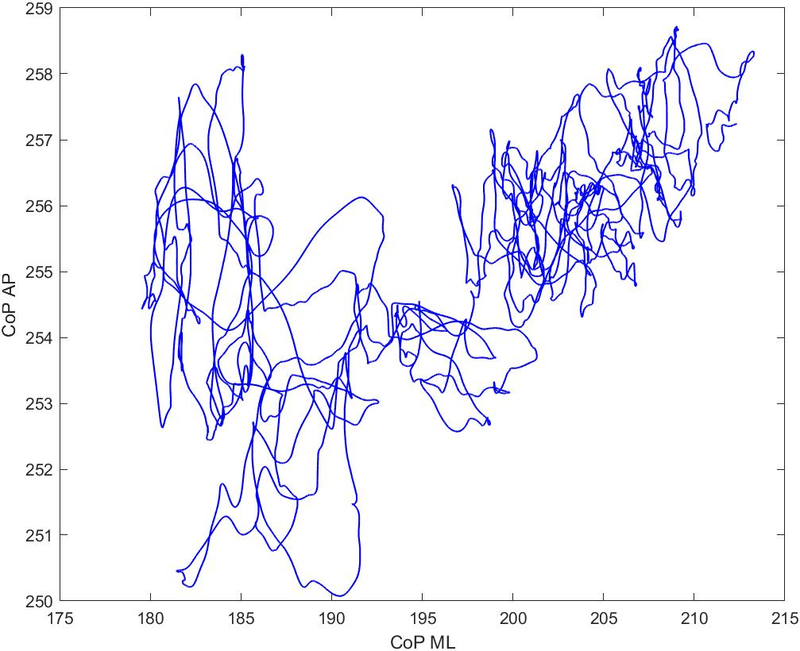

# Posturography Analysis
This repository hosts scripts for the analysis of human posturography data.

## Postural Assessment Using Center of Pressure Data
`CoP_posturography.m`: This function uses anteroposterior and mediolateral center of pressure data acquired from force platforms
to calcultate multiple outcome measures related to postural stability. 

`CoP_posturography_impliment.m`: This script provides a template for implimenting the `CoP_posturography` function. It uses data from posture_example_data.xlxs. It also plots the CoP data prior to running the function, as shown below: 

